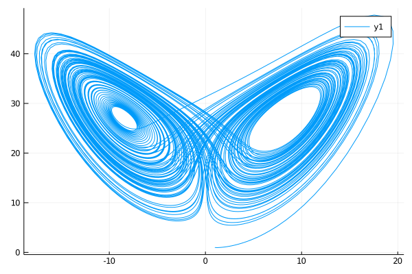
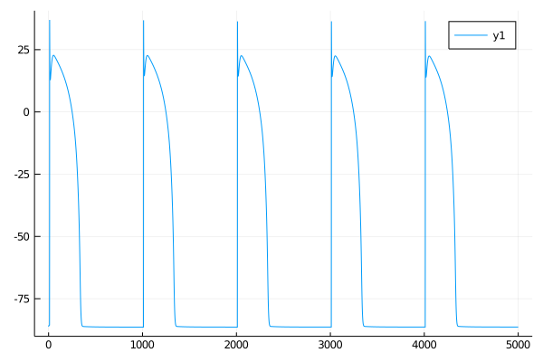
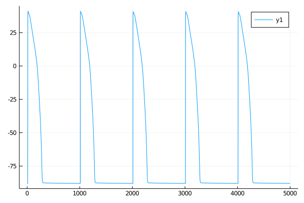
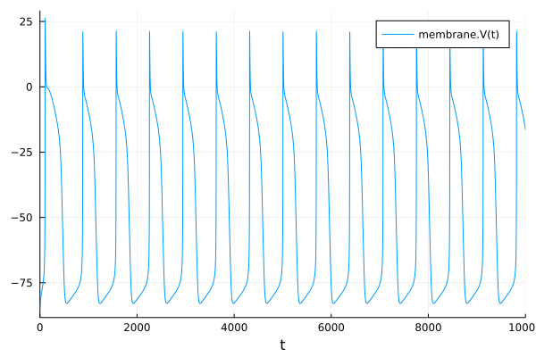

# CellMLToolkit.jl

[](https://julialang.zulipchat.com/#narrow/stream/279055-sciml-bridged)
[](https://docs.sciml.ai/CellMLToolkit/stable/)

[](https://codecov.io/gh/SciML/CellMLToolkit.jl)
[](https://github.com/SciML/CellMLToolkit.jl/actions?query=workflow%3ACI)

[](https://github.com/SciML/ColPrac)
[](https://github.com/SciML/SciMLStyle)

CellMLToolkit.jl is a Julia library that connects [CellML](https://www.cellml.org/) models to [SciML](https://github.com/SciML/), the Scientific Julia ecosystem. CellMLToolkit.jl acts as a bridge between CellML and ModelingToolkit.jl. It imports a CellML model (in XML) and emits a ModelingToolkit.jl intermediate representation (IR), which can then enter the SciML ecosystem.

## Tutorials and Documentation

For information on using the package,
[see the stable documentation](https://docs.sciml.ai/CellMLToolkit/stable/). Use the
[in-development documentation](https://docs.sciml.ai/CellMLToolkit/dev/) for the version of
the documentation, which contains the unreleased features.

## CellML

[CellML](https://www.cellml.org) is an XML-based open-standard for the exchange of mathematical models. CellML originally started in 1998 by the Auckland Bioengineering Institute at the University of Auckland and affiliated research groups. Since then, its [repository](https://models.physiomeproject.org/welcome) has grown to more than a thousand models. While CellML is not domain-specific, its focus has been on biomedical models. Currently, the active categories in the repository are *Calcium Dynamics*, *Cardiovascular Circulation*, *Cell Cycle*, *Cell Migration*, *Circadian Rhythms*, *Electrophysiology*, *Endocrine*, *Excitation-Contraction Coupling*, *Gene Regulation*, *Hepatology*, *Immunology*, *Ion Transport*, *Mechanical Constitutive Laws*, *Metabolism*, *Myofilament Mechanics*, *Neurobiology*, *pH Regulation*, *PKPD*, *Protein Modules*, *Signal Transduction*, and *Synthetic Biology*. There are many software tools to import, process and run CellML models; however, these tools are not Julia-specific.

## SciML

[SciML](https://github.com/SciML) is a collection of Julia libraries for open source scientific computing and machine learning. The centerpiece of SciML is [DifferentialEquations.jl](https://github.com/SciML/DifferentialEquations.jl), which provides a rich set of ordinary differential equations (ODE) solvers. One major peripheral component of SciML is [ModelingToolkit.jl](https://github.com/SciML/ModelingToolkit.jl). It is a modeling framework for high-performance symbolic-numeric computation in scientific computing and scientific machine learning. The core of ModelingToolkit.jl is an IR language to code the scientific problems of interest at a high level. Automatic code generation and differentiation allow for the generation of a usable model for the other components of SciML, such as DifferentialEquations.jl.

## Installation

To install CellMLToolkit.jl, use the Julia package manager:

```julia
using Pkg
Pkg.add("CellMLToolkit")
```

## Simple Example

```Julia
  using CellMLToolkit, DifferentialEquations, Plots

  ml = CellModel("models/lorenz.cellml.xml")
  prob = ODEProblem(ml, (0,100.0))
  sol = solve(prob)
  plot(sol, idxs=(1,3))       # idxs keyword has superseded vars keyword
```

Note that `models` is a directory of the CellMLToolkit package. You can find its path as

```Julia
  model_root = joinpath(splitdir(pathof(CellMLToolkit))[1], "..", "models")
```

and then

```julia
model_path = joinpath(model_root, "lorenz.cellml.xml")
ml = CellModel(model_path)
```

## Tutorial

The models directory contains a few CellML model examples. Let's start with a simple one, the famous Lorenz equations.

```Julia
  using CellMLToolkit

  ml = CellModel("models/lorenz.cellml.xml")
```

Now, `ml` is a `CellModel` structure that contains both a list of the loaded XML files and their components (accessible as `ml.doc`) and a ModelingToolkit `System` that defines variables and dynamics and can be accessed as `getsys(ml)`.

The next step is to convert `ml` into an `ODEProblem`, ready to be solved.

```Julia
  prob = ODEProblem(ml, (0,100.0))
```

Here, `(0,100.0)` is the `tspan` parameter, describing the integration range of the independent variable.
In addition to the model equations, the initial conditions and parameters are also read from the XML file(s) and are available as `prob.u0` and `prob.ps`, respectively. We can solve and visualize `prob` as

```Julia
  using DifferentialEquations, Plots

  sol = solve(prob)
  plot(sol, idxs=(1,3))       # idxs keyword has superseded vars keyword
```

As expected,



Let's look at more complicated examples. The next one is the [ten Tusscher-Noble-Noble-Panfilov human left ventricular action potential model](https://journals.physiology.org/doi/full/10.1152/ajpheart.00794.2003). This is a mid-range electrophysiology model with 17 states variables and relatively good numerical stability.

```Julia
  ml = CellModel("models/tentusscher_noble_noble_panfilov_2004_a.cellml.xml")
  prob = ODEProblem(ml, (0, 10000.0))
  sol = solve(prob, dtmax=1.0)    # we need to set dtmax to allow for on-time stimulation 
  plot(sol, idxs=12)
```



We can tell which variable to plot (`idxs=12` here) by looking at the output of `list_states(ml)` (see below).

Let's see how we can modify the initial values and parameters. We will use the Beeler-Reuter model with 8 state variables as an example:

```Julia
  ml = CellModel("models/beeler_reuter_1977.cellml.xml")
```

The model parameters are listed as `list_params(ml)`:

```Julia
                  sodium_current₊g_Na => 0.04
                  sodium_current₊E_Na => 50.0
                 sodium_current₊g_Nac => 3.0e-5
         stimulus_protocol₊IstimStart => 10.0
           stimulus_protocol₊IstimEnd => 50000.0
     stimulus_protocol₊IstimAmplitude => 0.5
        stimulus_protocol₊IstimPeriod => 1000.0
 stimulus_protocol₊IstimPulseDuration => 1.0
              slow_inward_current₊g_s => 0.0009
                           membrane₊C => 0.01
```

Note the form of the parameter and variable names. They are composed of two names joined by a ₊ sign. The first name is the
component name in CellML models (e.g., sodium_current, stimulus_protocol) and the second name is the actual variable name.

Similarly, we can list the state variables by calling `list_states(ml)`:

```Julia
              slow_inward_current_d_gate₊d(time) => 0.003
              slow_inward_current_f_gate₊f(time) => 0.994
                   slow_inward_current₊Cai(time) => 0.0001
 time_dependent_outward_current_x1_gate₊x1(time) => 0.0001   
                   sodium_current_m_gate₊m(time) => 0.011
                   sodium_current_h_gate₊h(time) => 0.988
                                membrane₊V(time) => -84.624
                   sodium_current_j_gate₊j(time) => 0.975
```

Assume we want to change `IstimPeriod`. We can easily do this with the help of `update_list!` utility function provided:

```Julia
  params = list_params(ml)
  update_list!(params, :stimulus_protocol₊IstimPeriod, 250.0)
  prob = ODEProblem(ml, (0, 10000.0); p=last.(params))  # note that you need to pass last.(params) and not params itself to ODEProblem
```

The rest is the same as before.

```Julia
  sol = solve(prob, dtmax=1.0)
  plot(sol, idxs=7)   # 7 is the index of membrane₊V
```

For the next example, we chose a complex model to stress the ODE solvers: [the O'Hara-Rudy left ventricular model](https://journals.plos.org/ploscompbiol/article?id=10.1371/journal.pcbi.1002061). This model has 49 state variables, is very stiff, and is prone to oscillation. In the previous versions of this document, we used `CVODE_BDF` from the Sundial suite (`using Sundials`) to solve this problem. Fortunately, DifferentialEquations.jl has advanced significantly such that an efficient and pure Julia solution to the O'Hara-Rudy model is possible.

```Julia
  ml = CellModel("models/ohara_rudy_cipa_v1_2017.cellml.xml")
  tspan = (0, 5000.0)
  prob = ODEProblem(ml, tspan);
  sol = solve(prob, dtmax=1.0)
  plot(sol, idxs=49)  # membrane₊v
```



## Multi-file Models (Import)

CellML specification allows for models spanning multiple XML files. In these models, the top level CellML XML file imports components from other CellML files, which in turn may import from other files. CellMLToolkit supports this functionality. It assumes that *the top-level file and all the imported files reside in the same directory*. `models/noble_1962` contained one such example:

```julia
ml = CellModel("models/noble_1962/Noble_1962.cellml")
prob = ODEProblem(ml, tspan)
sol = solve(prob, dtmax = 0.5)
```

Note that the syntax is exactly the same as before. However, the list of the imported files are printed during `CellModel` generation:

```
[ Info: importing Noble62_Na_channel.cellml
[ Info: importing Noble62_units.cellml
[ Info: importing Noble62_K_channel.cellml
[ Info: importing Noble62_units.cellml
[ Info: importing Noble62_L_channel.cellml
[ Info: importing Noble62_units.cellml
[ Info: importing Noble62_units.cellml
[ Info: importing Noble62_parameters.cellml
[ Info: importing Noble62_units.cellml
```

Same as before, we can plot the output as

```julia
plot(sol, idxs = 2)
```



