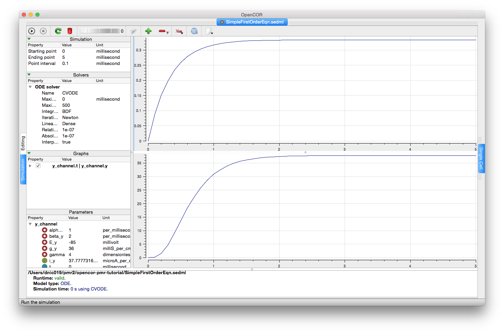

Gating kinetics explained
-------------------------

The *A model of ion channel gating and current: Introducing CellML units* section in the tutorial introduces the concept of units in CellML models, and along the way provides an explanation of gating kinetics that are common when investigating ion channel behaviour (at least those channels which are voltage senstitive). As such, `this model <SimpleFirstOrderEqn.cellml/view>`__ provides a neat little toy for investigating the formulation of traditional ion channel models.

Once again, the `corresponding SED-ML document <SimpleFirstOrderEqn.sedml>`__ is available to help get the reader started. The results of this simulation are shown in the figure below.

   
   A screenshot illustrating the results when the associated SED-ML document is loaded into OpenCOR and the simulation executed.
   
   This can be reproduced directly from the repository by choosing the **Launch with OpenCOR** link from the *Views Available*.