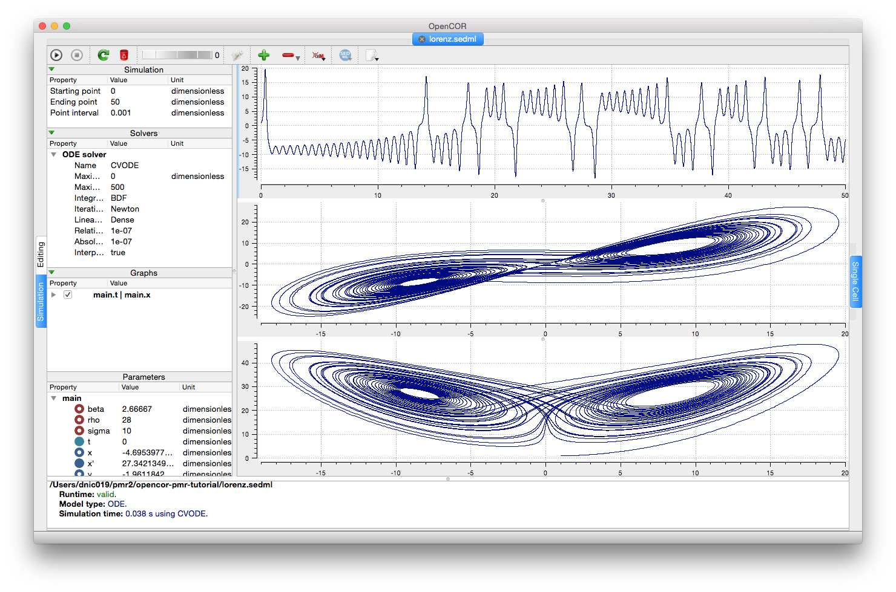

The Lorenz attractor
--------------------

The `Lorenz attractor <lorenz.cellml/view>`__ model is used as both an example of interesting dynamics and an illustration of the encoding of a third order differential equation as `three first order equations <lorenz.cellml/cellml_math>`__ in CellML. The figure below illustrates the results obtain by loading the `corresponding SED-ML document <lorenz.sedml>`__ into OpenCOR and executing the simulation.

   
   A screenshot illustrating the results when the associated SED-ML document is loaded into OpenCOR and the simulation executed.
   
   This can be reproduced directly from the repository by choosing the **Launch with OpenCOR** link from the *Views Available*.