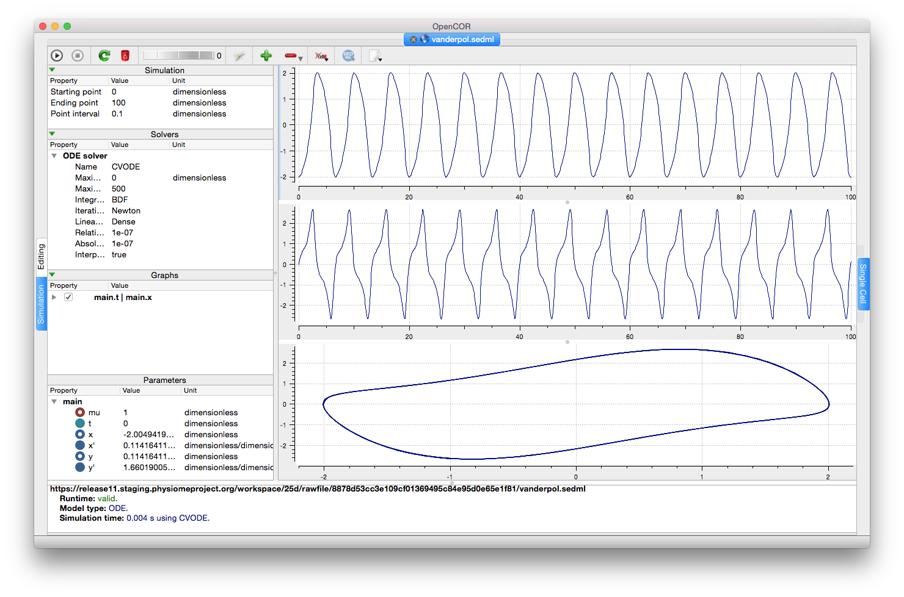

Van der Pol oscillator
----------------------

Used in the *Create and run a simple CellML model: editing and simulation* section of the tutorial, the classical `Van der Pol oscillator <vanderpol.cellml>`_ is the first model described in the tutorial. The simulation experiment for this model described in the tutorial can be obtained by loading the `corresponding SED-ML document <vanderpol.sedml>`_ into OpenCOR and executing the simulation. The results of which are shown below. A rendering of the mathematical model itself is available `here <vanderpol.cellml/cellml_math>`_.

   
   A screenshot illustrating the results when the associated SED-ML document is loaded into OpenCOR and the simulation executed.
   
   This can be reproduced directly from the repository by choosing the **Launch with OpenCOR** link from the *Views Available*.